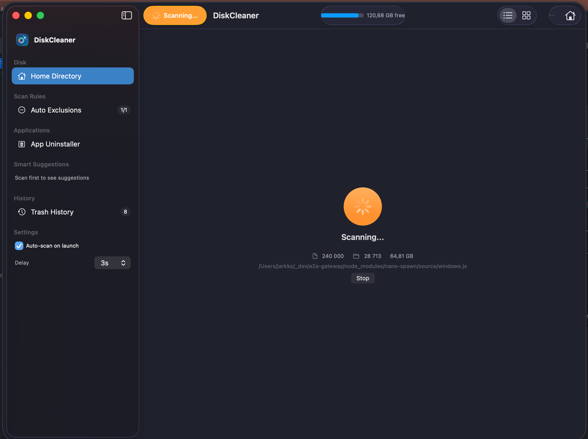

# DiskCleaner

DiskCleaner is a native macOS app for finding and removing wasted disk space.

It combines fast filesystem scanning, visual exploration, smart cleanup suggestions, and an app uninstaller that includes associated data across `~/Library`.

## Why This Repository Exists

This repo is both:

- A working SwiftUI macOS utility.
- A reference implementation for the PromptDev concept shown on the Repromptable business site (`https://repromptable.lovable.app/`).

If you are exploring prompt-native software delivery, the `promptdev/` folder shows how an implementation can be documented as replayable prompt assets.

See `PROMPT-DEV.md` for the concept walkthrough.

## Core Features

- Disk scan with progress, cancellation, and Home vs Full Disk access modes.
- File Tree view with hierarchy, selection, and size bars.
- Treemap visualization with hover, zoom, and breadcrumbs.
- Smart Suggestions for common space-waster categories.
- Safe deletion flow using Trash (not permanent delete).
- App Uninstaller that finds app bundles and associated files.

## Tech Stack

- SwiftUI (macOS 14+)
- Observation framework (`@Observable`)
- Actor-based services (`async`/`await`)
- AppKit interop where needed (`NSWorkspace`, `NSImage`)

## Architecture

- Pattern: MVVM + actor services.
- Coordinator: `AppViewModel` owns feature view models and shared services.
- Services: scanning, suggestions, deletion, permissions, app discovery.
- Views: sidebar-driven `NavigationSplitView` with contextual detail panes.

## Project Layout

- `DiskCleaner/Models` - domain models (`FileNode`, `InstalledApp`, etc.)
- `DiskCleaner/Services` - actor-based filesystem/business services
- `DiskCleaner/ViewModels` - UI state and feature orchestration
- `DiskCleaner/Views` - SwiftUI screens/components
- `DiskCleaner/Algorithms` - treemap layout algorithm
- `DiskCleaner/Utilities` - URL helpers, file type classification
- `promptdev` - PromptDev analysis + replay documents

## Getting Started

1. Open `DiskCleaner.xcodeproj` in Xcode 15+.
2. Select the `DiskCleaner` target.
3. Run on macOS 14+.
4. Start with a Home Directory scan, then switch to Full Disk if needed.

## PromptDev Companion Docs

- Concept and positioning: `PROMPT-DEV.md`
- PromptDev index: `promptdev/00-index.md`
- Prompt chain: `promptdev/03-prompt-chain.md`

## Download

[Download DiskCleaner v0.9.1](https://github.com/ljack/macos-disk-cleaner/releases/download/v0.9.1/DiskCleaner-v0.9.1.dmg) (signed + notarized)

[All releases](https://github.com/ljack/macos-disk-cleaner/releases)

## Screenshot

